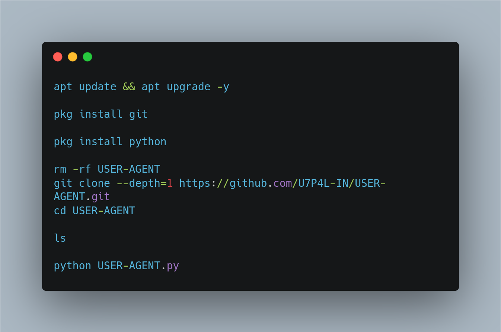
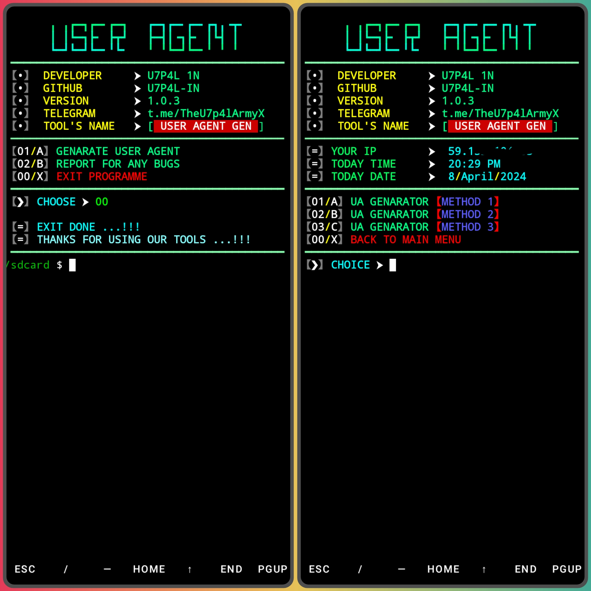
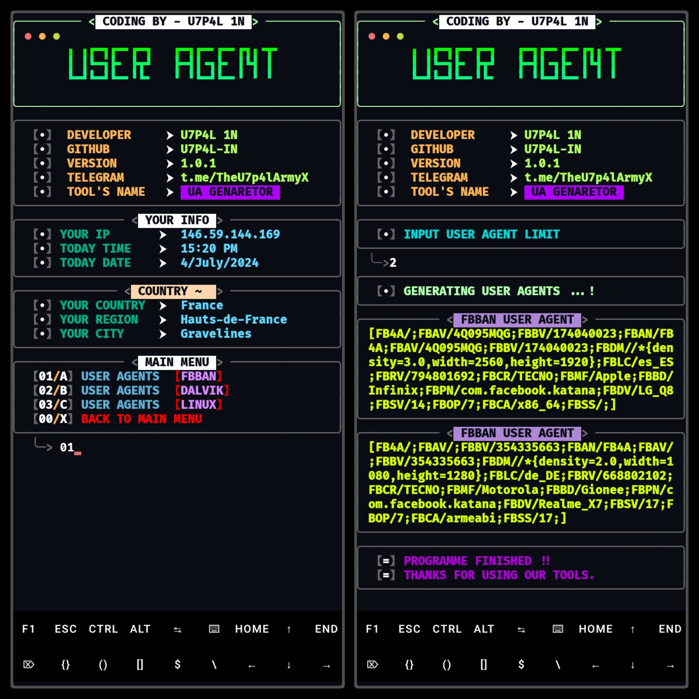
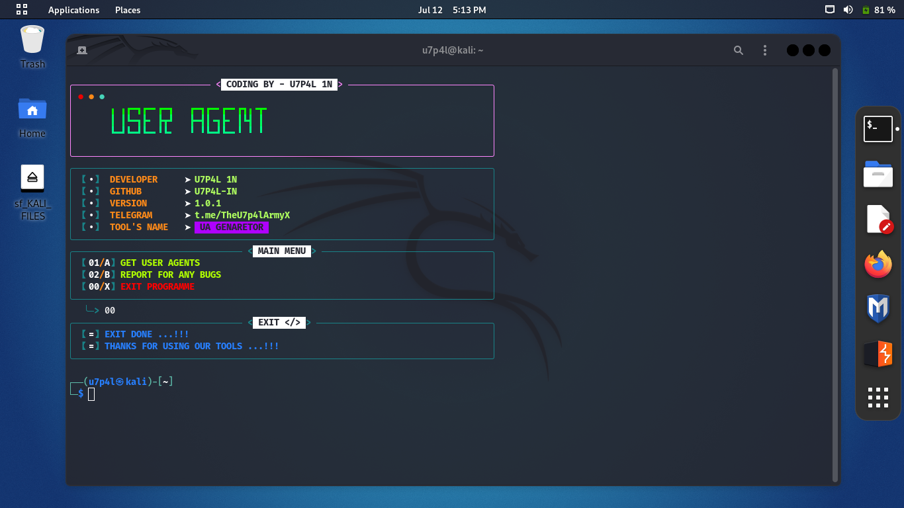
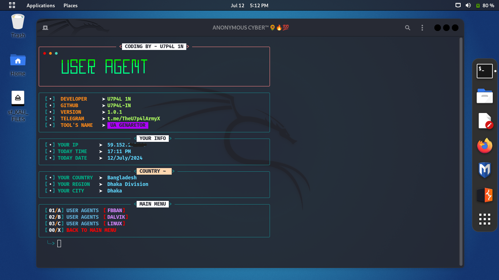
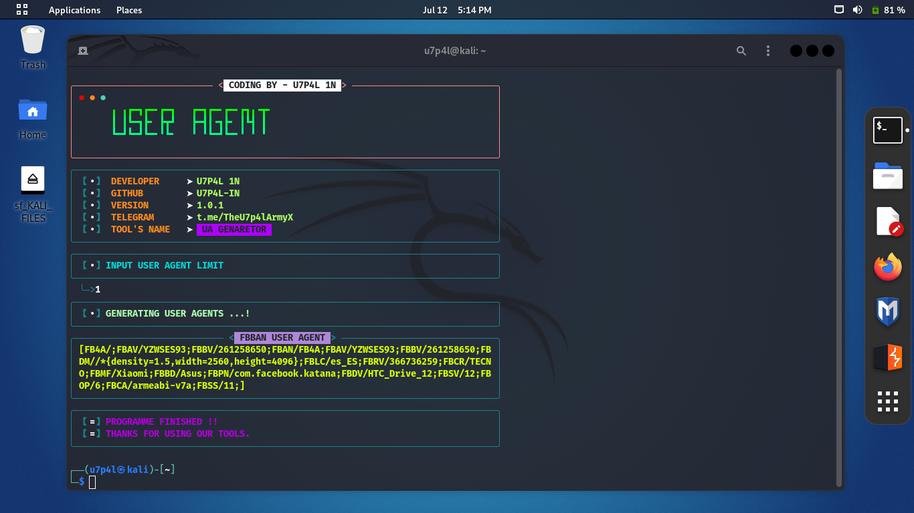
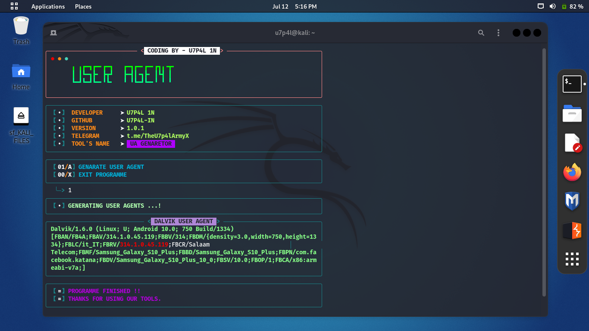
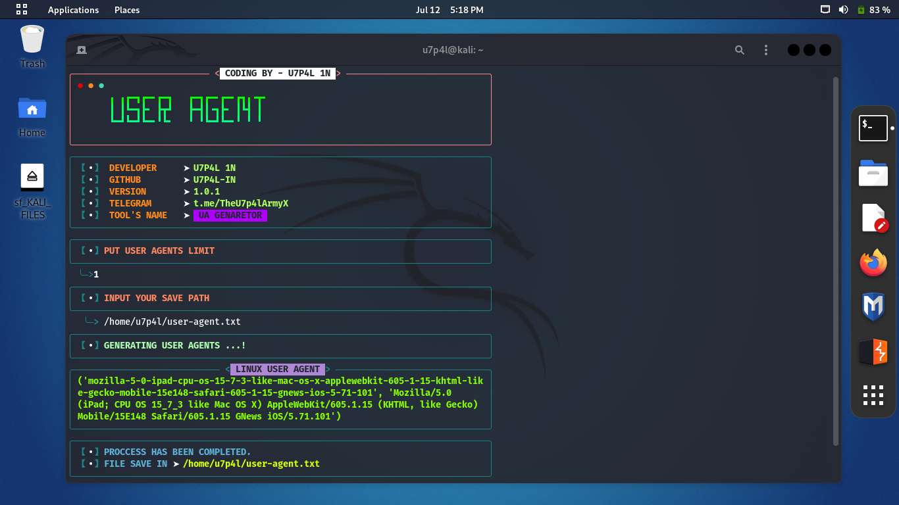

<p align="center">
</p>

  <div align="center"><a href="https://github.com/U7P4L-IN/USER-AGENT/stargazers/"></a><a href="https://github.com/U7P4L-IN/USER-AGENT/network/members/"></a><a href="https://github.com/U7P4L-IN/USER-AGENT/issues"></div>
  <div align="center"></a><a href="https://github.com/U7P4L-IN/USER-AGENT/pull"></a><a href="https://github.com/U7P4L-IN/USER-AGENT/archive/refs/heads/master.zip"></a></div></br>

</br><h2 align="left">Language > </h2><br>
<p align="center">
 

> A user agent is a relatively short bit of text that (attempts to) describe the Software/Browser (the "Agent") that is making the request to a website. Web browsers include the user agent string in the requests they make to websites. The User Agent often includes descriptions of the Operating System and Device Type that the Browser/Agent is running on.</i></b></h2>

### Tested On :

* Kali Linux
* BlackArch Linux
* Ubuntu
* Kali Nethunter
* Termux ( Rooted/NonRooted Devices)

## ChangeLogs
- [1] Fixed updating
- [2] Changed User interface
- [3] Added Features
- [4] Improved Speed
- [5] And thats about it, if you face any errors or bugs kindly mail them to me or open an Issue in github

## Contributing
Feel Free To Clone This Project. For Major Changes, Please Open An Issue First To Discuss What You Would Like To Change Or Add, Thank You!!.


</br><h1 align="center">Installation > </h1>

<h2 align="left">Termux > </h2><br>

```python
apt update && apt upgrade -y
pkg install git
pkg install python
rm -rf USER-AGENT
git clone --depth=1 https://github.com/U7P4L-IN/USER-AGENT.git
cd USER-AGENT
python3 UA.py
```
<p align="center">
</p>
<p align="center">
</p>
<p align="center">
</p>
<p align="center">
</p>

# Report bugs
If you notice issues while installing this tool or running this tool kindly mail to me at <a href="mailto: liosame0007@gmail.com">Gmail</a> or Open an issue via github.

### Requirements 
```
python-3
pip
Internet Connection
And some other python packages
``` 
[Python 3](https://www.python.org/downloads/)

<hr>

<h2 align="left">Install Requirements (on Linux) > </h2><br>

```python
>> apt-get install git python3 python3-pip python python-pip
```
<h2 align="left">Kali Linux/Ubuntu/Parrot os > </h2><br>

```python
sudo apt-get update && apt-get install git
git clone https://github.com/U7P4L-IN/USER-AGENT.git
cd USER-AGENT
ls
sudo python3 UA.py
```

<p align="center">
</p>
<p align="center">
</p>
<p align="center">
</p>
<p align="center">
</p>
<p align="center">
</p>

### Languages :

<p align="center">
</p>


<h2 align="center">LICENSE</h2>

USER-AGENT is released under the MIT license, which grants the following permissions:
- Commercial use
- Modification
- Distribution
- Patent use
- Private use

For more convoluted language, see the [LICENSE](/LICENSE).
</br>

<p align="center">  <a href="https://t.me/TheU7p4lArmyX"></a></p>

</br>

# Report bugs
If you notice issues while installing this tool or running this tool kindly mail to me at <a href="mailto: lisame0007@gmail.com">Gmail</a> or Open an issue via github.

<h5 align="center"><b>DESCRIPTION</b></h5>

* ©️ Copyright Message
>> Copyright © [2023-27] [U7P4L-IN]
>All rights reserved. This Python project, along with its code, documentation, and any associated files, is the intellectual property of ANONYMOUS CYBER. You may not reproduce, distribute, or modify the contents of this repository without explicit permission from the owner.
# Give A Star ⭐

> You can also give this repository a star to show more people and they can use this repository.
